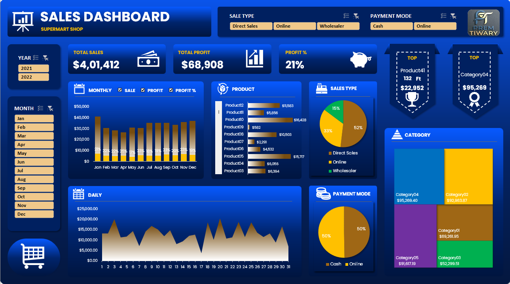

# Sales-Performance-Dashboard-Excel
Interactive Sales and Revenue Dashboard built using MS Excel with data analysis and PowerPoint UI design.

---

## 🖼️ Dashboard Preview

> *Note: Since GitHub does not preview Excel files directly, please refer to the screenshot above or download the `.xlsx` file to explore the interactivity.*

---

# 📊 Sales & Revenue Performance Dashboard Project - Supermart Store Analysis 

---

## 📝 Project Overview
This project involves a comprehensive analysis of sales data and generate meaningful insights using data cleaning, analysis, and visualization techniques for **Supermart Store**. The goal was to transform raw transactional data into a professional, interactive dashboard that helps stakeholders track KPIs and business growth.

---

## 🎨 Key Features
- **Custom UI/UX:** Designed a premium dashboard background in **PowerPoint** for a modern look.
- **Dynamic KPIs:** Real-time tracking of Total Sales ($401.4K), Total Profit ($68.8K), and Profit Margin (17%).
- **Interactive Slicers:** Users can filter data by **Sales Type, Payment Mode, and Timeline (Monthly/Yearly)**.
- **Trend Analysis:** Visual representation of monthly sales and profit growth.

---

## 🛠️ Tools & Skills Used
- **Microsoft Excel:** Pivot Tables, Advanced Formulas, Power Query.
- **PowerPoint:** Dashboard UI/UX Design.
- **Data Visualization:** Clustered Bar Charts, Line Charts, and Area Charts.
- **Data Cleaning:** Merging Master Data with Transactional Input Data.

---

## 📈 Key Insights from Analysis
1. **High Performing Category:** Category 04 contributed significantly to the total revenue.
2. **Preferred Payment Mode:** A large portion of sales were driven by Online payments.
3. **Monthly Growth:** January and December saw the highest peaks in sales volume.

---

## 🎯 Learning Outcome
Through this project, I improved my skills in:
- Data Analysis  
- Data Visualization  
- Dashboard Design  
- Excel Functions & Charts

---

## Author 
**Name:** Prem Tiwary  
**Email:** premtiwary7050@gmail.com 
**LinkedIn:** www.linkedin.com/in/prem-tiwary

---

## License
This repository is for demonstration and learning purposes. Feel free to reuse the code with attribution.
